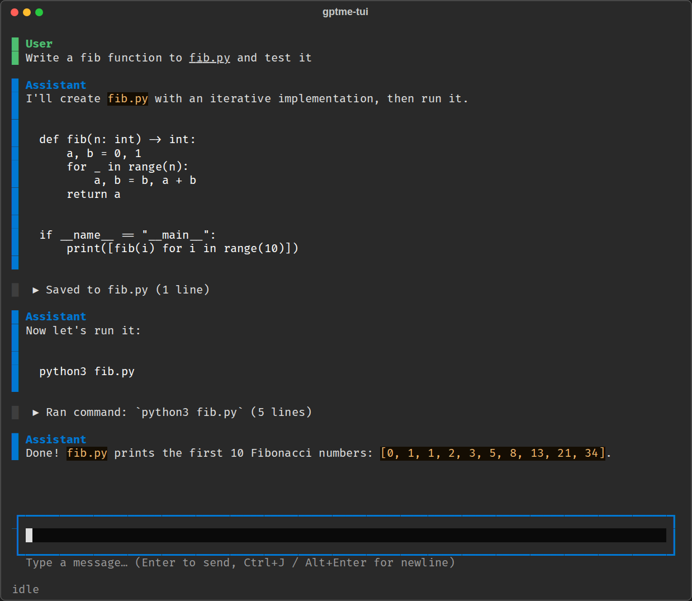

:audience: user

TUI
===

gptme ships an optional Textual-based terminal UI, ``gptme-tui``, complementary
to the plain :doc:`CLI <cli>` (which remains better suited for non-interactive
and scripted use).

It addresses two long-standing UX limitations of the plain CLI
(see :issue:`569`):

- **Prompt queueing**: type and submit new prompts while the agent is working.
  They are shown dimmed in the conversation and dispatched automatically when
  the current turn finishes.

- **Compact, expandable output**: tool output is collapsed to a one-line
  summary by default (like HTML ``
``); click it or press
  :kbd:`Ctrl+O` to expand.

It also provides a persistent status bar showing the current model, token
usage relative to the context window, and agent state.

Installation
------------

The TUI requires the ``tui`` extra::

    pipx install 'gptme[tui]'

Usage
-----

Start a new conversation in the current directory::

    gptme-tui

Or start with a prompt, like with ``gptme`` (chain several with ``-``)::

    gptme-tui "write a script that counts lines" - "now add tests"

Pick a conversation to resume from a list (or start a new one), or resume
a specific one by name::

    gptme-tui --resume
    gptme-tui --resume <name>

Conversations are stored in the same format and location as CLI conversations,
so they can be opened interchangeably: start in the TUI, resume in the CLI
(``gptme --resume``), or vice versa (``gptme-tui -n <name>``).

To switch without leaving the conversation, use ``/restart cli`` in the TUI or
``/restart tui`` in the CLI. ``/restart web`` opens the conversation in the
:doc:`web UI <webui>` of a running ``gptme-server``
(see :doc:`commands`).

Inline mode (experimental)
--------------------------

By default the TUI runs in the alternate screen with its own scrollable chat
view. With ``--inline`` it instead renders like Claude Code: messages are
printed into the terminal's **native scrollback** while only a small live
region (streaming preview, input, status bar) stays at the bottom::

    gptme-tui --inline

Terminal/tmux scrolling then works normally, and the transcript stays in your
scrollback after exit. Prompts submitted while the agent works are listed
above the input until they are sent. Trade-offs: past tool output can't be
expanded in place (:kbd:`Ctrl+O` instead toggles whether *future* tool output
and thinking print expanded), mouse interaction is left entirely to the terminal, and
dragging the terminal narrower can leave fragments of the input area in the
scrollback.

Display settings
----------------

``/display`` changes what the TUI shows; it never changes what the model does
(for reasoning effort, see :ref:`reasoning-effort`). Run it alone to list the
current settings.

- ``/display thinking [on|off]``: model thinking. Hidden by default: a
  finished message shows a one-line placeholder, and the live preview shows
  only the response. Set ``GPTME_TUI_DISPLAY_THINKING=1`` to show it from
  startup.
- ``/display outputs [on|off]``: expand or collapse tool output.
- ``/display hidden [on|off]``: messages sent to the model but normally not
  shown, such as token-usage and time notices. Off by default; set
  ``GPTME_TUI_DISPLAY_HIDDEN=1`` to show them from startup.

:kbd:`Ctrl+O` is the shorthand for both: it expands tool output and thinking,
or collapses both when both are already expanded.

Without ``on``/``off`` the setting toggles. In the default view the change
applies to existing messages; in inline mode it applies to messages printed
afterwards.

Keys
----

=================  ==========================================================
Key                Action
=================  ==========================================================
:kbd:`Enter`       Send prompt (queues it if the agent is busy)
:kbd:`Alt+Enter`   Insert newline (:kbd:`Ctrl+J` also works)
:kbd:`Tab`         Complete slash-commands and their arguments
:kbd:`Escape`      Interrupt generation
:kbd:`Ctrl+C`      Interrupt generation, or quit when idle
:kbd:`Ctrl+D`      Quit
:kbd:`Ctrl+O`      Expand/collapse all tool outputs and thinking
=================  ==========================================================

When a tool is about to execute, a confirmation dialog shows a preview;
press :kbd:`y` to execute, :kbd:`n` to skip, or :kbd:`a` to auto-confirm for
the rest of the session.

Commands
--------

The TUI supports the same :doc:`slash-commands <commands>` as the CLI
(``/model``, ``/undo``, ``/tokens``, …), with the same Tab completion,
by routing them through the shared command registry. Command output is
shown inline in the conversation. ``/quit`` is a TUI-local alias for
``/exit``, and ``/display`` (see `Display settings`_) is TUI-only.

Limitations
-----------

The TUI is young and intentionally minimal. Commands that need an external
terminal program (e.g. ``/edit`` spawning ``$EDITOR``) don't work yet; switch
the conversation to the CLI for those with ``/restart cli``. Non-interactive/scripted use should
keep using ``gptme`` directly.
